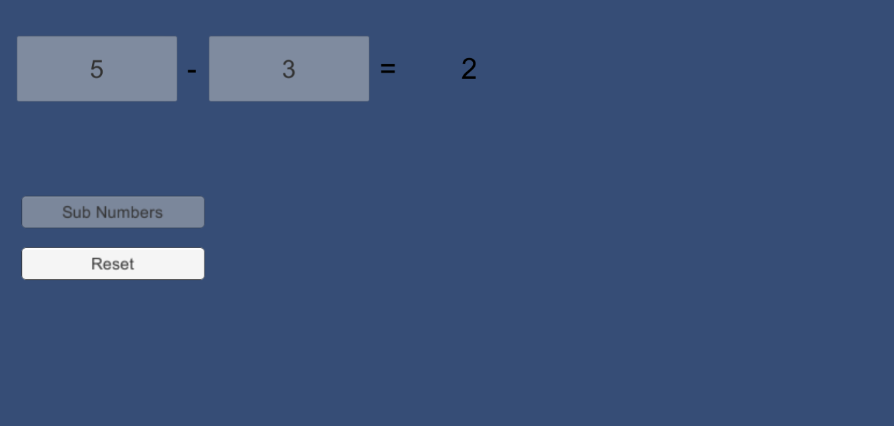
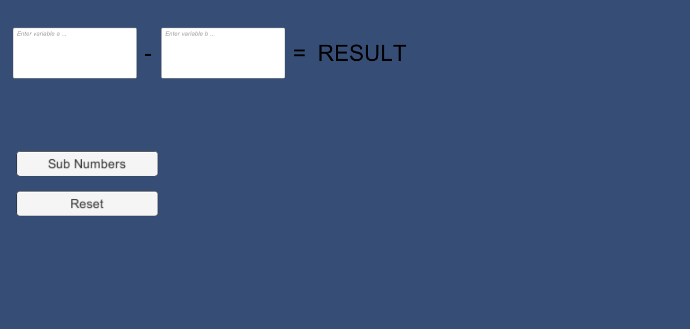

# Unity2019114f1-2D-Template

### Project description: 
Two Inputfields in which numbers can be put in. The script substract the second number from the first and displays the result.

### Development platform: 
- Mac OS Mojave
- Unity 2019.1.f.14
- Visual Studio Code

### Target platform: 
WebGL 1920x780

### Visuals: 

##### Programm Executed:

##### Programm Initialisation

 

### Necessary setup/execution steps: 
nothing

### Third party material: 
gitHub Template: https://github.com/3ahmnm-htlsbg/Unity2019114f1-2D-Template

### Project state: 
100%

### Limitations: 
none

### Lessons Learned: 
- How to create public variables, assign values to them in the scene
- Call Methods from "On-Click"
- How to make objects uninteractable

Copyright by gerum1